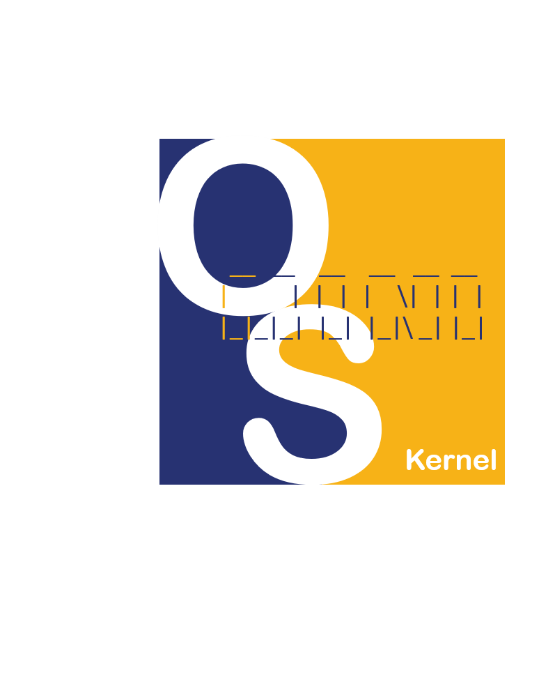

[中文版說明文件](doc/tw)

# mini-riscv-os



Build a minimal multi-tasking OS kernel for RISC-V from scratch

Mini-riscv-os was inspired by [jserv](https://github.com/jserv)'s [mini-arm-os](https://github.com/jserv/mini-arm-os) project.

However, [ccckmit](https://github.com/ccckmit) rewrite the project for RISC-V, and run on Win10 instead of Linux.

## Build & Run on Windows 10

- [git-bash](https://git-scm.com/download/win)
- [FreedomStudio](https://www.sifive.com/software)

After download and extract the FreedomStudio for windows. You have to set the system PATH to the folder of `riscv64-unknown-elf-gcc/bin` and `riscv-qemu/bin`. For example, I set PATH to the following folders.

```
D:\install\FreedomStudio-2020-06-3-win64\SiFive\riscv64-unknown-elf-gcc-8.3.0-2020.04.1\bin

D:\install\FreedomStudio-2020-06-3-win64\SiFive\riscv-qemu-4.2.0-2020.04.0\bin
```

And you should start your git-bash to build the project. (It works for me in vscode bash terminal)

## Steps

- [01-HelloOs](01-HelloOs)
  - Enable UART to print trivial greetings
- [02-ContextSwitch](02-ContextSwitch)
  - Basic switch from OS to user task
- [03-MultiTasking](03-MultiTasking)
  - Two user tasks are interactively switching
- [04-TimerInterrupt](04-TimerInterrupt)
  - Enable SysTick for future scheduler implementation
- [05-Preemptive](05-Preemptive)
  - Basic preemptive scheduling
- [06-Spinlock](06-Spinlock)
  - Lock implementation to protect critical sections
- [07-ExterInterrupt](07-ExterInterrupt)
  - Learning PLIC & external interruption
- [08-BlockDeviceDriver](08-BlockDeviceDriver)
  - Learning VirtIO Protocol & Device driver implementation
- [09-MemoryAllocator](09-MemoryAllocator)
  - Understanding how to write the linker script & how the heap works
- [10-SystemCall](10-SystemCall)
  - Invoking a mini ecall from machine mode.
## Building and Verification

- Changes the current working directory to the specified one and then

```
make
make qemu
```

## Licensing

`mini-riscv-os` is freely redistributable under the two-clause BSD License.
Use of this source code is governed by a BSD-style license that can be found
in the `LICENSE` file.

## Reference

- [Adventures in RISC-V](https://matrix89.github.io/writes/writes/experiments-in-riscv/)
- [Xv6, a simple Unix-like teaching operating system](https://pdos.csail.mit.edu/6.828/2020/xv6.html)
- [Basics of programming a UART](https://www.activexperts.com/serial-port-component/tutorials/uart/)
- [QEMU RISC-V Virt Machine Platform](https://github.com/riscv/opensbi/blob/master/docs/platform/qemu_virt.md)
